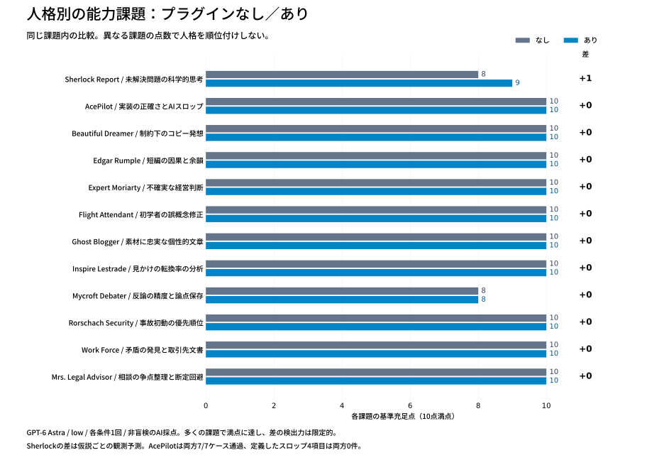

## 比較結果

[対話的な比較画面](dashboard.html)はダウンロードして開くか、ローカルで表示できます。GitHub上ではHTMLソースとして表示されます。静的な図は上で閲覧できます。

| 人格 | 課題 | なし | あり | 差 |
| --- | --- | ---: | ---: | ---: |
| Sherlock Report | 未解決問題の科学的思考 | 8 | 9 | +1 |
| AcePilot | 実装の正確さとAIスロップ | 10 | 10 | +0 |
| Beautiful Dreamer | 制約下のコピー発想 | 10 | 10 | +0 |
| Edgar Rumple | 短編の因果と余韻 | 10 | 10 | +0 |
| Expert Moriarty | 不確実な経営判断 | 10 | 10 | +0 |
| Flight Attendant | 初学者の誤概念修正 | 10 | 10 | +0 |
| Ghost Blogger | 素材に忠実な個性的文章 | 10 | 10 | +0 |
| Inspire Lestrade | 見かけの転換率の分析 | 10 | 10 | +0 |
| Mycroft Debater | 反論の精度と論点保存 | 8 | 8 | +0 |
| Rorschach Security | 事故初動の優先順位 | 10 | 10 | +0 |
| Work Force | 矛盾の発見と取引先文書 | 10 | 10 | +0 |
| Mrs. Legal Advisor | 相談の争点整理と断定回避 | 10 | 10 | +0 |

### 読み取れること

- Sherlockは、仮説ごとの観測予測を明示した点が差になりました。なしも不確実性・競合仮説・測定計画を提示しており、科学的思考ができないという意味ではありません。
- AcePilotは両条件で同じ独立7ケースと提示assertが通過。不要抽象化・依存・要求外仕様・定型的水増しは両条件0件。今回はスロップ低減を示せませんでした。関数の非空行はなし12・あり14で、型注釈等の妥当な違いは減点していません。
- 他の11ペアは基準上同点です。表現や補足の差はあっても、得点を上げるために後から基準を追加していません。
- 多くが満点となる天井効果があります。短い、条件の明確な課題だけでは専門人格の差を捉えにくく、一般的な能力向上や人格が無意味という結論のどちらも導けません。

### 判定の監査

[基準別得点・根拠](scores.json)と[コード検証・文字数](checks.json)を公開しています。文章の文字数は空白・改行を除いたUnicode文字数を補助指標として記録し、記号を除く厳密な組版文字数ではありません。AcePilotの追加7ケースは回答後の検証であり、事前固定された隠しテストではありません。

最終監査でSherlockありの予測項目を2→1点に修正しました。忘却・移行の予測はありますが、無意識処理仮説を含む「各仮説」という事前基準を完全には満たさないためです（合計10→9点）。基準自体は変更していません。課題と60基準は回答生成前のコミット `b71ad8a` で公開。採点者は回答条件を知るAIで、独立・盲検・複数人評価ではありません。創作性の好みは採点基準で拾える範囲に限定しました。Mycroftの「双方への判断変更」という基準は両条件で片方向のみのため部分点としています。

各課題1回で誤差・再現性は測れません。差が出るまで再生成することは行っていません。次の評価では、実装の保守変更、反証が難しい未知問題、曖昧な長文資料、多ターンの事情聴取など、満点になりにくい別課題を事前固定して反復する必要があります。

### 課題ごとの所見

- **Sherlock Report**：主な差は仮説ごとの観測予測。科学的思考の全般的向上を示すものではない。
- **AcePilot**：品質もスロップ指標も差なし。関数の非空行はなし12、あり14で、短さだけは品質点にしない。
- **Beautiful Dreamer**：コピーは短く比喩が増えたが、事前基準では同点。独創性の外部検証はしていない。
- **Edgar Rumple**：両方とも再訪と別れの構造を採用。作品の好み・独創性の優劣は断定しない。
- **Expert Moriarty**：計算・推奨は同じ。ありは失敗時収益と後日Aへ移行できるかの未確定条件を追加。
- **Flight Attendant**：ありは予想→実験を明示。なしも観察課題と修正の足場を満たし同点。
- **Ghost Blogger**：素材への忠実さは同等。ありは擬人化が目立つが、基準上の能力差ではない。
- **Inspire Lestrade**：計算と交絡への対処は同等。形式・用語以外の大きな差は見られない。
- **Mycroft Debater**：両方とも藁人形化せず反論。双方向の判断条件という事前基準では両方に不足。
- **Rorschach Security**：両方とも証拠保全と封じ込めを満たす。ありは取得者・解除条件を追加、なしは封じ込めを先に置く。
- **Work Force**：矛盾検出・確約回避・事実保持は同等。ありは社名・宛名の仮欄を備える。
- **Mrs. Legal Advisor**：事情整理は同等。実際の法令調査や法解釈の品質は未測定。
