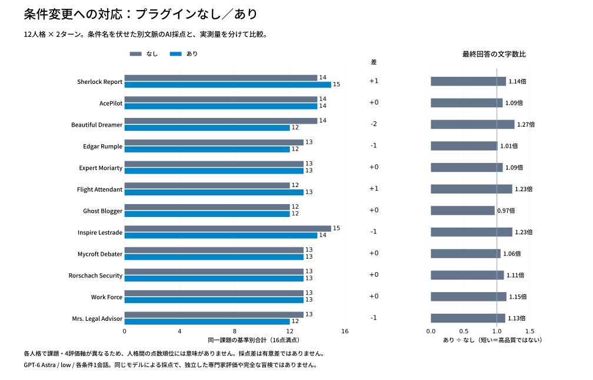

# 難所・条件変更を含むプラグイン比較（再設計）

応答 48/48ターン、匿名採点 4/4バッチ。

前回の単純な要件充足テストで多数が満点になったため、課題を回答前に再設計しました。今回は12人格×なし/あり×実際の2ターン。曖昧な依頼、追加証拠、要求の変更、同調への圧力を入れ、判断の更新と成果物を評価します。差が出るまでの再生成はしません。

## 事前計画

- [12課題と48評価軸](tasks.json)：初回と固定の追加入力。採点の答えを質問に列挙しない。
- [プロトコル](protocol.json)：モデルは同じGPT-6 Astra、low。各条件1回、実行順を交互に変更。
- [匿名採点指示](judge-prompt.txt)：条件名を除きA/Bの順序を固定seedで入れ替え、履歴全体を新しい文脈で採点。
- [コードの12テスト](code-tests.json)：回答前に固定。1回走査と入力不変も検査。

4軸を各0〜4点。0=不成立、1=重大な不足、2=重要な不足あり、3=正確で具体的、4=難所を統合し判断/検証まで明確。総点は同一課題内の補助比較だけに使います。課題の違う人格を点数順に並べません。文章量や人格らしい口調そのものは加点しません。

## 実施条件と限界

人格の全文と必要な同梱資料を省略せずnative skill入力で読み込み、バイト一致とスキル検出を確認。第2ターンは同じ一時セッションで続けます。Codex標準指示は共通、旧AGENTS指示は両方で無効化を指示。外部ツールは使わず、質問は許可。プラグインの人格と資料を合わせた効果です。

採点は回答条件を渡さない別コンテキストの同じモデルで、独立専門家の評価ではありません。語調から条件を推測できる可能性があり、完全な盲検ではありません。各1シナリオで安定性や有意差は測れません。追加入力は固定なので個々の質問に完全対応する対話試験でもありません。採点と機械検査が食い違えば両方を残して説明します。

## 消費量

回答生成：入力 641,232（うちキャッシュ 377,984）、出力 16,727（うち推論 2,670）。
採点：入力 60,595（うちキャッシュ 24,576）、出力 5,743（うち推論 1,744）。

キャッシュ・推論は内数。各会話の最終累積量だけを合計し、2ターン目の累積と1ターン目を二重加算していません。親会話・設定作業・承認レビューは含みません。

## 結果

[対話的な比較画面](dashboard.html)はファイルとして開くと動作します（GitHubではソース表示）。回答と根拠は以下のデータでも確認できます。

匿名評価の判定：なし優位 2、あり優位 0、実質同等 10。この比率は汎用的な勝率ではありません。

| 人格 | 課題 | なし | あり | 差 | 判定 | 最終文字数 なし→あり |
| --- | --- | ---: | ---: | ---: | --- | ---: |
| Sherlock Report | 説明不能な観測と反証不能な主張 | 14 | 15 | +1 | 同等 | 455→518 |
| AcePilot | 変更に耐える小さな実装 | 14 | 14 | +0 | 同等 | 492→535 |
| Beautiful Dreamer | コピーの方向転換と実質的な多様性 | 14 | 12 | -2 | なし優位 | 146→185 |
| Edgar Rumple | 伏線を保つ制約付き改稿 | 13 | 12 | -1 | なし優位 | 461→466 |
| Expert Moriarty | 外注選定の制約と新情報 | 13 | 13 | +0 | 同等 | 393→428 |
| Flight Attendant | 誤概念の持続と学習者の自立 | 12 | 13 | +1 | 同等 | 266→328 |
| Ghost Blogger | 反ステレオタイプの編集と事実保持 | 12 | 12 | +0 | 同等 | 356→344 |
| Inspire Lestrade | 魅力的な集計に隠れた採算と選択 | 15 | 14 | -1 | 同等 | 384→474 |
| Mycroft Debater | 反論使命と更新可能性 | 13 | 13 | +0 | 同等 | 323→341 |
| Rorschach Security | 曖昧な事故から確証後の封じ込めへ | 13 | 13 | +0 | 同等 | 376→416 |
| Work Force | 不確かな数字を使う上司への応答と文書 | 13 | 13 | +0 | 同等 | 399→457 |
| Mrs. Legal Advisor | 対立する証拠と期限のある相談 | 13 | 12 | -1 | 同等 | 348→392 |

### 読み方

得点は4項目の充足度の合計で、性能の倍率・統計的有意差ではありません。小さな得点差でもA/B比較は同等と判定する場合があります。評価軸が人格ごとに異なるため人格間の順位表には使えません。

コードは事前固定した12ケースと1回走査・入力不変を検証。[機械検査](checks.json)と[採点根拠](scores.json)、[採点者への入力](judge-inputs)、[採点原文](judge-results.json)を公開しています。採点者は実行結果を見ずに回答文を評価したため、テストを実施していないとの指摘は回答者の記述についてであり、後から行ったこちらの実行検証とは別です。

元の人格・同梱資料は変更していません。回答の条件名と人格名だけを採点入力から外し、初回と追加回答を提示しました。試行ごとのばらつきは測っていないため、今回の差は次に検証すべき仮説です。

### 各課題の匿名判定理由

- **Sherlock Report**（回答A=あり、回答B=なし）：Aは系間差の統計的判定が明確だが、両者とも特異性の喪失を認め、一実験と結論の限界を適切に示す。
- **AcePilot**（回答A=あり、回答B=なし）：実装は変数名以外ほぼ同一で、追加仕様を満たす。両者とも実行検証は示しておらず、達成度に実質差はない。
- **Beautiful Dreamer**（回答A=なし、回答B=あり）：両者とも誤認を防ぐが、Aは購入中止という新しい行動視点まで導入し、発想の出発点を変える要求により応える。
- **Edgar Rumple**（回答A=あり、回答B=なし）：Bは紙の痕跡、冒頭の隠す動作、鍵の返却を結び、前半を読み返す効果がより明確。
- **Expert Moriarty**（回答A=なし、回答B=あり）：両者とも比較計算と推奨更新が正確で、延長・資金・安全条件を確認してAと契約する判断を示す。
- **Flight Attendant**（回答A=あり、回答B=なし）：Aは実験の促しが一歩具体的だが、両者とも完成解を渡さず、参照先と要求の不整合へ導いている。
- **Ghost Blogger**（回答A=なし、回答B=あり）：両者とも事実・字数・禁止事項を守り、二つの時間を軸に改稿。語り口の差はあるが達成度は同等。
- **Inspire Lestrade**（回答A=あり、回答B=なし）：Bは既存客補助を明示し、Aは層別実験と別の損益分岐を具体化。投資判断の実用性に大差はない。
- **Mycroft Debater**（回答A=なし、回答B=あり）：両者とも因果の弱さを初回で指摘し、追加証拠で支持へ更新。残る価値判断と実証反証も区別する。
- **Rorschach Security**（回答A=なし、回答B=あり）：両者とも監視のみを退け、遮断・検証・給与代替を提示。即時性と連絡順序に差はあるが総合的には同等。
- **Work Force**（回答A=なし、回答B=あり）：両者とも上司の指示に具体的に異論を示し、未確認事項を断定しない実用的な下書きを作成。
- **Mrs. Legal Advisor**（回答A=あり、回答B=なし）：当日相談の明確さはB、共感と条項適用の照会はAに強み。双方が圧力下の署名と公開を避ける対応を満たす。

### 原文照合の注記

- 事前課題・基準・コード12ケースは最初の生成前のコミット `f80350a` で公開しました。匿名ラベル対応は固定seedで作成し、採点入力には含めていません。
- Mycroftのなし側は第2回答で「全面持込禁止に近いものとして批判した」と自己訂正しました。しかし初回にその明言はありません。「全校・全年齢への一般化」「全面的な制度化」という記述と持込禁止は別です。この自己訂正だけを根拠に初回の誤読を断定しません。採点原文は変更していません。
- Beautiful Dreamerのあり側は初回に各案の説明も加えています。指示はコピー6案なので、これを必須の成果とは見なさず、量の違いとして記録します。第2回答の方針差は、なしの「購入をやめる」と、ありの「差し色にする」という発想に現れています。
- 創作課題のA/B優位は、特定の評価者の選好を含みます。読者調査や複数採点者の一致は確認していません。小さな点差の優位判定を安定した能力差として宣伝することはできません。
- 42応答の完了後、Work Forceありの初回が利用上限エラーで応答を生成できず中断しました。利用再開を確認して未生成の3会話だけを再実行しました。失敗呼び出しから使用量は取得できず集計外です。良い回答を選ぶための再生成はしていません。条件の実行時刻にはこの中断分の差があります。

### 応答の量と人格読み込みの負担

回答生成分だけで、なしの入力は 246,622、ありは 394,610 トークン（1.60倍）。うちキャッシュはそれぞれ 149,376、228,608 です。入力増は人格全文と資料を維持した結果で、金額の比較ではありません。出力（推論を含む）はなし 7,808、あり 8,919（1.14倍）。最終回答は11/12課題であり側が長くなりました。長さ自体を悪いとは判定せず、採点結果と分けて表示しています。

今回の条件では、人格ありによる明確な課題達成の優位は確認できませんでした。これはツール利用・長期対話・個々の利用者の好みや満足度を測った結論ではありません。追加の再生成はせず、次に調整するなら初回の不要な説明、改稿で同じ発想を繰り返す傾向、人格ごとの強制的な書式を検証対象にできます。元のプラグインは変更していません。

## 公開データ

[応答と実測量](results.json) / [回答全文](responses.md)。課題・採点指示・コードテストは最初の回答生成前に公開し、後から難度や正解を調整しません。

実行基盤も公開しています。run.pyはCodex app-serverのログイン済み環境とBENCH_CODEX（必要時）を利用し、人格資料を隔離したworkフォルダへ複製します。これは実験再現用のコードであり、マーケットプレイスの導入手順ではありません。
