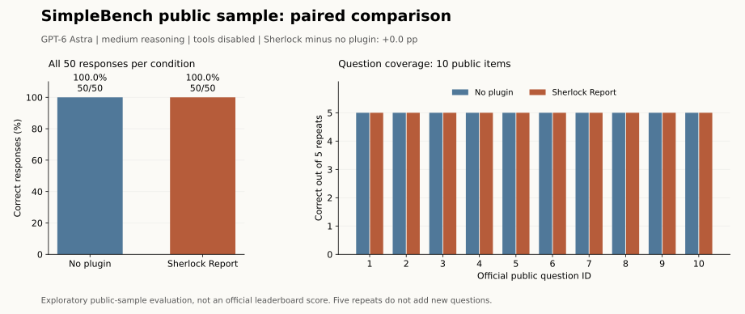

# SimpleBench公開10問：プラグインなし / Sherlock Report

**公式ランキングのスコアではありません。** 公開サンプル全10問を各条件5回ずつ、履歴を共有しない新しい会話で評価します。

状態：**100/100回答完了**。GPT-6 Astra / reasoning medium / ツール無効。

| 条件 | 正解数 | 正答率 | 平均応答時間 | 入力 / 出力トークン |
|---|---:|---:|---:|---:|
| プラグインなし | 50/50 | 100.0% | 5.57秒 | 508,900 / 3,227 |
| Sherlock Report | 50/50 | 100.0% | 5.62秒 | 854,500 / 3,242 |

この公開サンプルでは同点でした。 差（Sherlock − なし）は **+0.0ポイント**。問題単位のペア・ブートストラップ95%区間は +0.0～+0.0ポイントです。公開10問の探索的結果であり、一般的な能力差を確立するものではありません。

50ペアの内訳：両方正解 50、なしのみ正解 0、Sherlockのみ正解 0、両方不正解 0。




## 比較条件と採点

- 問題は公式公開JSONの全10問。翻訳・書き換え・選択肢変更・成績による選別はありません。公式の非公開問題群にはアクセスしていません。
- モデル、推論設定、共通指示、問題文、ツール制限は両条件で共通。Sherlock条件だけに改変していないSKILL.md全文をnative skill入力で適用します。スキル検出とバイト一致を確認しています。
- Codexの通常ホスト指示は共通して残ります。「プラグインなし」はSherlockを読み込まないCodexであり、システム指示のない素のAPIモデルではありません。
- 各問題×各条件×各反復に新規コンテキストを作成。固定seedで問題順を決め、先に実行する条件を交互に変更します。検索・Python・その他ツール、記憶、追加プラグインは無効です。
- 共通の実行制約に公式system_promptを追加。両条件に簡潔な説明を求めます。temperature、top-p、出力トークン上限は明示指定せず、Codex/モデルの既定値を用います。公式ランキングと実行条件は異なります。
- 正解キーは解答モデルに渡しません。公式実装と同じ正規表現で最初の `Final Answer: A～F` を抽出し、正解キーと比較します。抽出失敗は不正解、複数マーカーは警告として記録します。LLM採点・手動修正はありません。
- 主指標は50回答の平均正答率。5回の多数決・最高点・pass@5ではありません。未完了は未完了として表示し、完了済みの回答を再生成しません。失敗・中断は自動再試行しません。
- 不確かさは10問を単位とするペア・ブートストラップ（10,000回、seed固定）で記述します。同じ問題の5反復を別々の50問とみなしません。検定による優越性の主張はしません。

## 問題ごとの結果

| 問題ID | なし | Sherlock | 差（正解数） |
|---|---:|---:|---:|
| 1 | 5/5 | 5/5 | +0 |
| 2 | 5/5 | 5/5 | +0 |
| 3 | 5/5 | 5/5 | +0 |
| 4 | 5/5 | 5/5 | +0 |
| 5 | 5/5 | 5/5 | +0 |
| 6 | 5/5 | 5/5 | +0 |
| 7 | 5/5 | 5/5 | +0 |
| 8 | 5/5 | 5/5 | +0 |
| 9 | 5/5 | 5/5 | +0 |
| 10 | 5/5 | 5/5 | +0 |

## 反復ごとの結果

| 反復 | なし | Sherlock |
|---|---:|---:|
| 1 | 10/10 | 10/10 |
| 2 | 10/10 | 10/10 |
| 3 | 10/10 | 10/10 |
| 4 | 10/10 | 10/10 |
| 5 | 10/10 | 10/10 |

## 解釈上の限界

公開済みの少数問題なので、学習時の接触や暗記を排除できません。5反復は回答の揺れを測りますが、問題の種類は10問のままです。ブートストラップ区間もこの少数問題に基づく記述的な目安です。全問同じ成績なら区間が0に縮んでも、未知問題での能力差がないことを証明しません。

今回はツールなしの選択式推論に限定しています。Sherlockのウェブ調査・Python検算・論文作成能力は測っていません。人格定義内の最大推論要求にかかわらず、推論設定は比較のため両方mediumに固定しています。同じモデル名でも提供側の更新は排除できません。

記録された評価呼び出しの総トークンは 1,369,869。キャッシュは入力の内数、推論トークンは出力の内数です。準備・集計を行う親タスクの使用量は含みません。最終回答形式の警告は 0 件です。応答時間はターン送信から完了までで、スキル検出や会話作成時間は含みません。

## 再現と監査

[固定プロトコル](protocol.json) / [事前固定した実行順](schedule.json) / [全100回答・正誤・使用量](results.json) / [実行コード](simplebench.py) / [採点と集計](report.py) / [検証](test_simplebench.py)

認証済みのCodex CLIとPython 3.10以降を使います。モデルとCLI版はprotocol.jsonに固定しています。別の版で実行するときは既存結果を上書きせず、別シリーズとして登録してください。

```powershell
python benchmarks/simplebench/simplebench.py prepare
python benchmarks/simplebench/simplebench.py preflight
python -m unittest discover -s benchmarks/simplebench -p "test_*.py"
# Commit protocol, schedule, and source before the first model call.
python benchmarks/simplebench/simplebench.py run
python benchmarks/simplebench/simplebench.py report
```

キャッシュはリポジトリ外の `../plugin-benchmark/simplebench-2026-09-19`。`--cache` で別のリポジトリ外フォルダを指定できます。そこに公式データ・最終応答・ローカル実行記録を保存します。モデルから返された最終回答だけを公開し、内部推論、認証情報、ローカルパスを含む生ログは公開しません。図は `python benchmarks/simplebench/plot.py` で再生成します（Matplotlibが必要）。

初回出題前の登録コミット：[ 7ee4a45 ](https://github.com/sharakusatoh/codex-plugins/commit/7ee4a45994390eac546e4a656102f17e9db5e636)。実行日時（UTC）：2026-09-19T03:28:03.257437+00:00 ～ 2026-09-19T09:44:42.962180+00:00。

## 出典

- [SimpleBench公式データとコード](https://github.com/simple-bench/SimpleBench/tree/fbc2e429085bdedad7d1a236d2bc9bc18c95f16e)。取得したJSONのSHA-256はprotocol.jsonに保存。上流のMITライセンスは [SIMPLEBENCH-LICENSE.txt](SIMPLEBENCH-LICENSE.txt) に収録。
- [SimpleBench公式サイト](https://simple-bench.com/)
- [Codex App Server公式資料](https://developers.openai.com/ja-JP/docs/app-server)


## 実行監査と中断記録

[最終監査](audit.json)で100回答すべてのモデル・推論設定・保存済み原文・正解キー照合・トークン集計の一致を確認しました。利用上限による回答なしの拒否が1件あり、利用枠のリセット後に残り56回答を再開しています。完了済み44回答の再生成はありません。[詳細と時刻](EXECUTION.md) / [中断記録](run-notes.json) / [監査コード](verify.py)。拒否時の使用量は返らず不明です。

今回、両条件の全回答が正解となり、公開10問には天井効果が見られます。正答率の改善も悪化も確認できず、プラグインが無意味、または一般に同等という結論は導けません。

Sherlockの入力トークンは 854,500、なしは 508,900 で、全文定義の追加により約 67.9% 多くなりました。キャッシュを含む入力総数の比較であり、課金額の比較ではありません。平均応答時間は 5.62秒 / 5.57秒で、この小さな差から速度の優劣は判断しません。

全ペアが同点のため、事前指定したパーセンタイル区間は0～0に退化しています。これは未知問題での差の不確かさを適切に推定できる区間ではありません。
